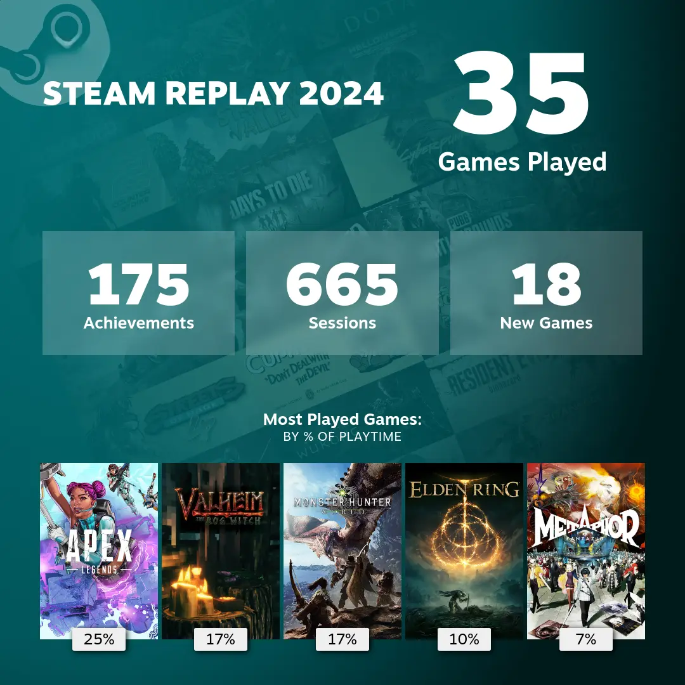

## Game

### Metaphor Refantazio

An engaging game that kept me hooked until the end.
When work or life gets too busy to spend long hours gaming, a JRPG like Metaphor offers great entertainment in shorter bursts.

### Blackmyth Wukong

A good action game but requires a lot of focus and attention. I couldn't finish it due to my busy schedule.
Games like this take too much energy, and I didn't feel refreshed playing it. Maybe I'll revisit it when my workload lightens.

What I really dislike is its high hardware requirements. I hate when studios push unreasonably high graphics to help sell more Nvidia GPUs.

### Monster Hunter Wild Public Test

Plays terribly.
I was super excited for it, but after playing the test, I'm hesitant to buy it at launch. Why do I need to see 99 other players in a lobby? Plus, the frame rate is **painfully low**.

I feel sorry for Capcom.

### Elden Ring DLC

Finished it in a weekend. My manager and colleagues were surprised when I mentioned it during a casual chat.
I didn't like the map exploration in the DLC, but overall, I had fun.

### Baldur's Gate 3

Playing Baldur's Gate 3 again with my partner was much more fun than playing solo.
Aside from my partner being a bit clumsy at times, the journey was extremely relaxing and enjoyable.

I love RPGs even more since working. They're truly relaxing. I don't need more stress outside of work.

### Valheim

Played this with a friend I met online and really enjoyed it. I feel like playing more survival and construction games with friends.

## Anime

Good Anime. Including anime that started in 2023 but ended in 2024.
Didn't have time to watch many anime this year.

- らんま1/2
- ダンダダン
- 逃げ上手の若君
- 負けヒロインが多すぎる！
- ダンジョン飯
- ガールズバンドクライ
- 葬送のフリーレン
- ダンジョン飯
- 薬屋のひとりごと

## TV & Moive

TV and movies I watched and thought were good in 2024. Not necessarily limited to TV and movies that aired in 2024.

- 仮面ライダーガヴ
- ウルトラマンアーク
- ラストマイル
- ルックバック
- 侵入者たちの晩餐
- Magpie Murders
- Moonlight Murders
- Only Murders in the Building Season 3 & 4
- Arcane Season 1 & 2
  I like the season 1 more.
- Ludwig
  Highly praised detective show. One classic trick an episode. It is often mentioned alongside _Moonlight Murders_. While I prefer the drama and characters in _Ludwig_, the tricks in _Moonlight Murders_ are more compelling. Both are highly entertaining shows in 2024.
- Fallout
