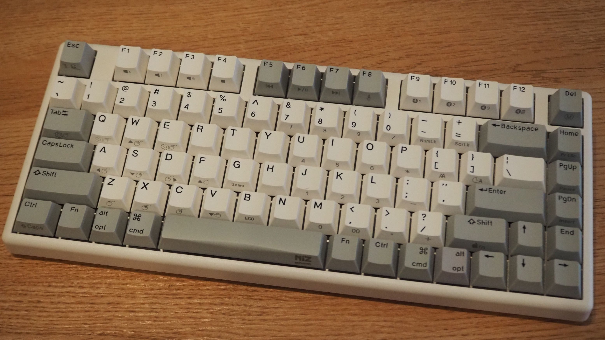
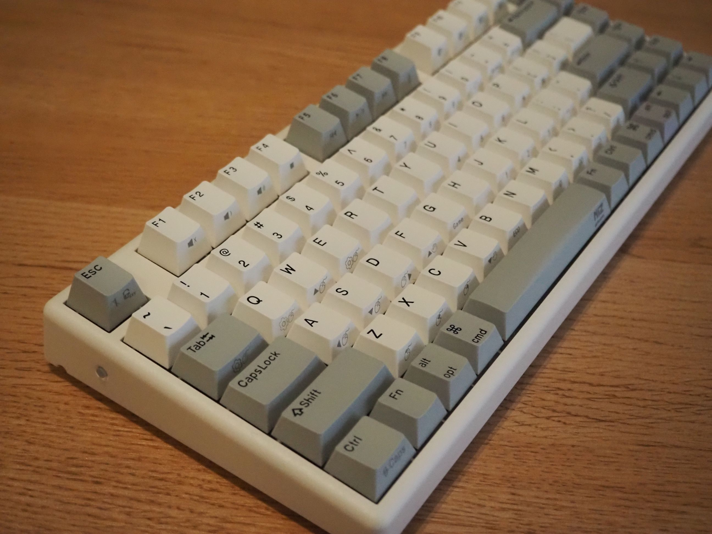
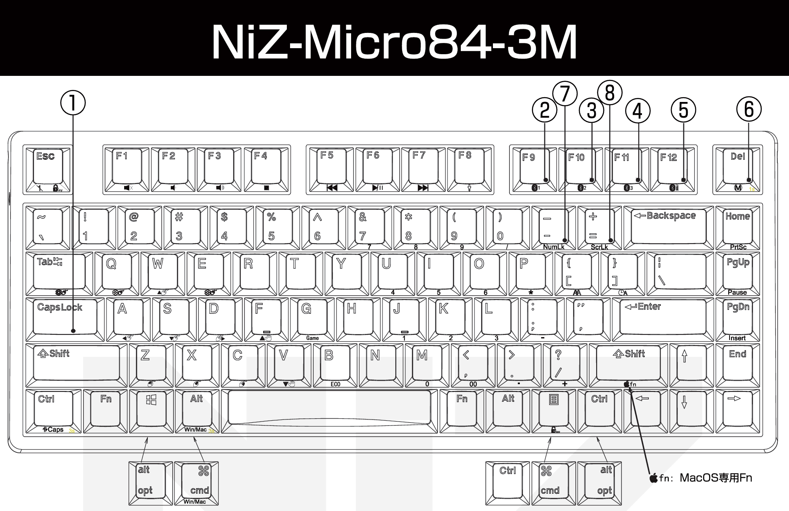
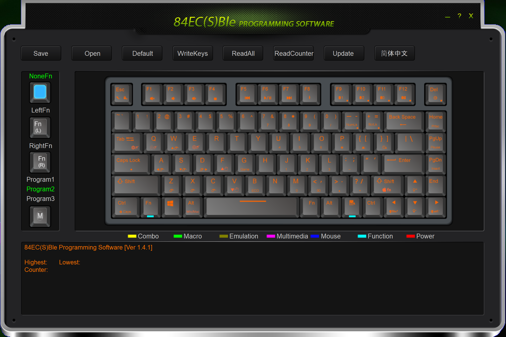

I finally own a electro-capacitive keyboard. Niz Micro 84.
It has a 35g of pressure switch and is a real pleasure to type on. PBT keycaps, great. It is also programmable, of course with some limits.
The model I bought supports Bluetooth and USB receiver.

Images credit to _Kani_.

The manuals, firmware and software are officially provided via Google Cloud. They look suspicious but they are official.

[Japanese](https://support.niz.store/portal/ja/kb/articles/download#%E5%B0%82%E7%94%A8%E3%82%BD%E3%83%95%E3%83%88%E3%82%A6%E3%82%A7%E3%82%A2%E3%83%BB%E3%83%95%E3%82%A1%E3%83%BC%E3%83%A0%E3%82%A6%E3%82%A7%E3%82%A2%E3%83%BB%E4%BB%95%E6%A7%98%E6%9B%B8)
[English](https://www.nizkeyboard.com/pages/firmware-upgrade)

There is no good keymap pictures for MacOS. So I cut this from Japanese manual:

There are a dozen of default shortcuts and they might be intimidating in the beginning. But after spending few minutes getting used to them, they can be very handy and easy.

In general I like Niz Micro 84.

## Like

+ The keyboard has a very different feeling from mechanical keyboards I have used. I like it.
+ It has a software to customize keys. Although not so good UI/UX.
+ The space bar is not too wide. More ergonomic for me. Honestly I bought the keyboard just for the space bar.

## Dislike

+ The power/battery key is on the left side. It's not a switch so you cannot tell which mode is on.
+ Cannot customize MacOS mode keys in its software. The software only works in Windows system and supports Windows keys.
+ The USB receiver does not work. Or I don't know how to make it connect to the keyboard.
+ The QR code on the back is a link to Niz's Wechat. Thought it might be a more useful link like manual.

## Customize Keys

The software looks ancient but it works.
I am surprised.

Screenshot of the software:

FN keys can also be customized. Making it very flexible.

However the software only works on Windows system with keyboard in Windows mode. It cannot customize Mac mode keys. I can resort to karabiner on MacOS, or I can use Windows mode on macOS and use macOS's system settings to configure modifier keys.

The Win key is recognized as CMD key in macOS. So I set:

1. CapsLock -> Ctrl
2. Ctrl key -> CMD key
3. CMD -> CapsLock

Now it works perfect for me.

As for Home, End, PageUp, and PageDown. I gave up on swapping them because the keycaps are at different heights and they don't fit into the other slots.
