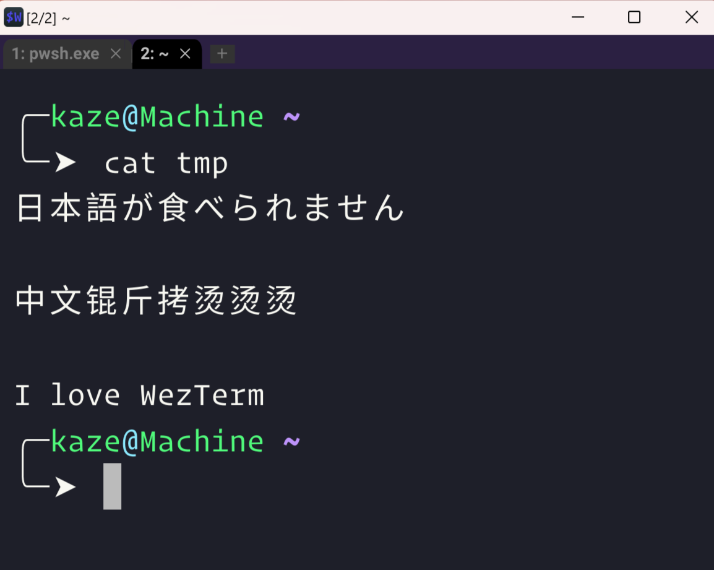

[WezTerm](https://wezfurlong.org/wezterm/index.html)

## Fallback Fonts

I have been using Windows Terminal since its release, and the experience has been great, especially when paired with WSL.

However, one issue that made me switch to WezTerm is Windows Terminal's lack of **fallback fonts**.

I also tried alternatives like Hyper and Tabby, but they came with their own problems. Finally, I decided to give WezTerm a try, and after some research and configuration, I found it to be an excellent terminal.

It even comes with color themes and fonts!



## My Config

I am using [Sarasa Mono SC](https://github.com/be5invis/Sarasa-Gothic) as fallback Chiniese font.

```lua
local wezterm = require 'wezterm'
local config = wezterm.config_builder()

config.color_scheme = 'Dracula'
config.default_prog = { "C:\\Program Files\\PowerShell\\7\\pwsh.exe" }
config.initial_cols = 130
config.initial_rows = 30
config.font = wezterm.font_with_fallback{
  'OperatorMono-Book', 'OperatorMono-Bold',
  'MonoLisa Nerd Font Mono',
  'Inconsolata Nerd Font',
  'Sarasa Mono SC',
}
config.font_size = 11
config.line_height = 1.2

config.wsl_domains = {
  {
    name = 'WSL',

    -- It must match a valid distribution from your `wsl -l -v` output in
    distribution = 'Ubuntu',

    default_prog = {"zsh"}
  },
 }

config.skip_close_confirmation_for_processes_named = {
  'bash',
  'sh',
  'zsh',
  'fish',
  'tmux',
  'nu',
  'cmd.exe',
  'pwsh.exe',
  'powershell.exe',
}

-- Key Config
local act = wezterm.action

config.keys = {
  {
    key = 'C',
    mods = 'CTRL',
    action = wezterm.action.CopyTo 'ClipboardAndPrimarySelection',
  },
  { key = 'v', mods = 'CTRL', action = act.PasteFrom 'Clipboard' },
  {
    key = 'w',
    mods = 'CTRL',
    action = wezterm.action.CloseCurrentPane { confirm = false },
  },
  {
    key = 't',
    mods = 'CTRL',
    action = act.SpawnTab 'CurrentPaneDomain',
  },
  {
    key = '@',
    mods = 'CTRL|SHIFT',
    action = act.SpawnTab { DomainName = 'WSL' },
  },
  {
    key = '!',
    mods = 'CTRL|SHIFT',
    action = act.SpawnTab "DefaultDomain",
  },
  { key = '[', mods = 'CTRL', action = act.ActivateTabRelative(-1) },
  { key = ']', mods = 'CTRL', action = act.ActivateTabRelative(1) },
  {
    key = 'Tab',
    mods = 'CTRL',
    action = wezterm.action.ActivateLastTab,
  },
  {
    key = 'P',
    mods = 'CTRL',
    action = wezterm.action.ActivateCommandPalette,
  },
  {
    key = '\'',
    mods = 'CTRL|ALT',
    action = wezterm.action.SplitHorizontal { domain = 'CurrentPaneDomain' },
  },
  {
    key = 'LeftArrow',
    mods = 'CTRL|ALT',
    action = act.ActivatePaneDirection 'Left',
  },
  {
    key = 'RightArrow',
    mods = 'CTRL|ALT',
    action = act.ActivatePaneDirection 'Right',
  },
  {
    key = 'UpArrow',
    mods = 'CTRL|ALT',
    action = act.ActivatePaneDirection 'Up',
  },
  {
    key = 'DownArrow',
    mods = 'CTRL|ALT',
    action = act.ActivatePaneDirection 'Down',
  },
  { key = '-', mods = 'CTRL', action = wezterm.action.DecreaseFontSize },
  { key = '=', mods = 'CTRL', action = wezterm.action.IncreaseFontSize },
  { key = 'q', mods = 'CTRL', action = wezterm.action.QuitApplication },
  { key = 'PageUp', action = act.ScrollByPage(-1) },
  { key = 'PageDown', action = act.ScrollByPage(1) },
}

-- Mouse bindings
config.mouse_bindings = {
  -- Alt-click will open the link under the mouse cursor
  {
    event = { Up = { streak = 1, button = 'Left' } },
    mods = 'ALT',
    action = wezterm.action.OpenLinkAtMouseCursor,
  },
}

-- Tab
for i = 1, 8 do
  -- CTRL+ALT + number to activate that tab
  table.insert(config.keys, {
    key = tostring(i),
    mods = 'CTRL',
    action = act.ActivateTab(i - 1),
  })
  -- F1 through F8 to activate that tab
  table.insert(config.keys, {
    key = 'F' .. tostring(i),
    action = act.ActivateTab(i - 1),
  })
end

return config
```
