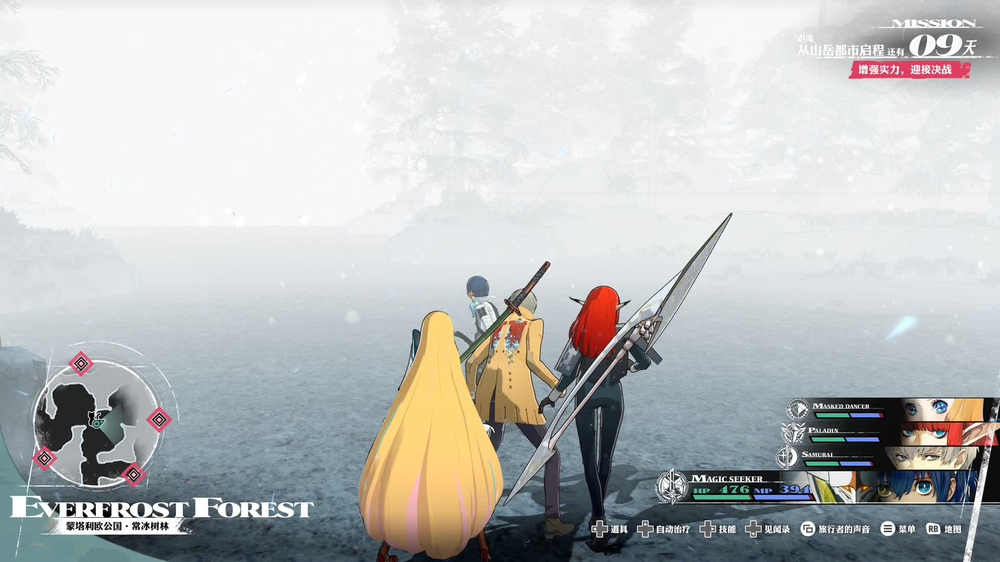

冒险感还是很好的。玩进去了很上头。Partner 总是问 Metaphor 这么好玩吗？你玩 Metaphor 吧。

100 小时终于通关普通难度。至少有 5 个小时是刷等级刷的，但是其实不是必要刷级的。我玩游戏比较抠门，不是无限获取的药物都不舍得用，所以刷了很久小怪回蓝。

2024 年的新游戏就这个进度最多了。可能 Elden Ring DLC 进度更多，因为流程短很多，很快打通关了。

## 技术

首先，Atlus 技术力真的烂，可惜了好的游戏设计。
剧情很感人，但是背景的粗糙树枝很出戏。
开宝箱居然还能技术倒退。
一个确定要点几次按钮。

## 视觉

其次，立刻下载 mod fix 这些烦人特效和画面摇晃。不知道 Atlus 内部怎么过的 Accessibility 这一关。
<https://github.com/Lyall/MetaphorFix>

逆天雪白的画面。下雪天气而已，有必要这么攻击玩家吗？

## Demo

开头 10 个小时是很劝退的，相当于 Demo 放出来的部分吧。不知道为什么要一开始就放那么多动画，不让玩家操作。说到动画，不知道是哪家给做的动画，也太劣质了。
实际上我打完第一个迷宫都感觉不够爽。没有摸清楚游戏机制。后面有 4 个队友甚至更多的时候才爽一点。

## Gameplay

回魔基本靠主角选魔法师的被动技能，第一个迷宫我就来回狂刷小怪，给我刷吐了。
后面有更好的职业，也可以回魔。不过之后的迷宫我没有刷，平推过去就好。除了最后几个高强度塔，埋头苦刷了好久。
这种刷小怪真是纯纯的浪费时间。那种迷宫中缓慢回复 MP 的药就该便宜点多给点。

怀疑是想通过刷小怪体现这作的场地战斗机制，Atlus 别老惦记你那场地战斗了。手感恶心，令人恼火。

### 逆天小怪

小怪攻击修正太多了，很追踪。
基本所有的怪都会后撤步，它跳过来追踪的矛戳我一下棍子敲我一下然后立刻后跳。我就只能看着主角被打倒，角色自然起身也非常慢，至少 1 秒吧。
还会有五月雨的弓箭手骷髅兵在远处大范围射箭。

### 职业系统

培养队友的职业也很麻烦。基本一个队友培养 2 个主要职业就不错了。为了继承技能不得不学很多职业，还得练到一定等级。
不过不用担心，游戏里最后一天打 Boss 前有足够升级的机会。效率也很高，我在这一天把队友升满了几个职业。

很多职业感觉很鸡肋，或者没有培养价值。现在的不上色的模型也太丑了，之后会弄得华丽点吗。
前期中期靠法师，后期感觉我的队伍的输出都是狂战士打的。皇家狂战士多上暴击 Buff 太猛了。

UI/UX 有点繁琐。因为需要来回切换看队友的职业技能和合体技能。谁记得哪几个职业合体技能是什么啊？只知道魔法师 + 魔法师=高级魔法，魔法师 + 牧师=多目标魔法。
还好最后有新东西出来后，合体技能容易了很多，不用把职业卡那么死。

Metaphor 这套系统还是复杂了点，Persona 的合面具既简单又很有爽感。

### 迷宫

迷宫少。迷宫根本不够刷啊！升级的素材还要种植！太小气了。
大迷宫就 3 个。小迷宫 2 个。重复地牢我分为 3 种：爬塔、野外图和钻洞爬梯子的地牢。

## 剧情

如果有恋爱要素就更好了。

小丑的剧情是真有点小丑。Edit: 不，后面发现也不是小丑。不过也挺搞笑的。

很喜欢日式王道 RPG 中追求理想的精神。

## 最后

那么，我抱怨这么多缺点，为什么还能玩呢？因为就听角色大喊合体技能名字就很爽，RPG 升级就是爽。
升级刷装备中间穿插着一点剧情，足够的动力了。

虽然骷髅兵给了我很大压力，但是打最终 Boss 配合上激昂的音乐和演出和暴击数字和经典大家请给我力量！让我可以忘记无数次拉我血压的咸鱼突刺骷髅兵。

王道 RPG 真好。
