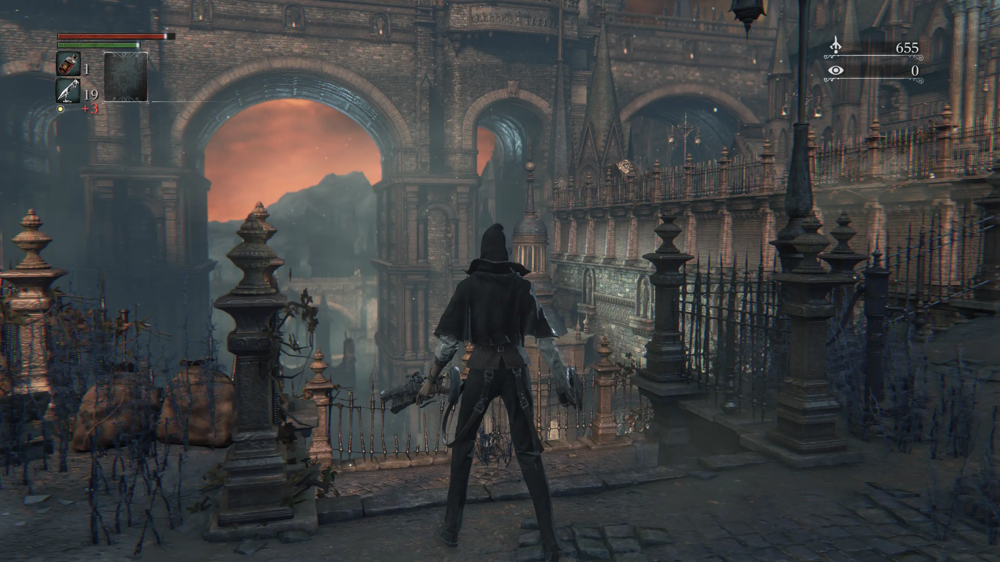

差不多 10 年前打通关的血源诅咒本体。DLC 没有玩。
在 PS4 上玩的，真亏我能忍受不稳定的 1080P 30 FPS 打通关了。

这篇文章记录一下在 PC 上爽玩 4K 60FPS 血源诅咒的方法，和再次游玩的感受。

## Game

高清 60 帧血源玩起来感觉真不一样。不需要刷经验，正常推图的等级打 boss 都 2 次之内过。不知道是帧数高了好操作还是 10 年前的我太菜了。

以前是看着攻略一步步走的，这次凭着记忆和多年的游戏经验探索地图，似乎也没那么可怕。
有些地方看着就知道有一堆狗、火枪手、甚至加特林，就走一步看一步。
体感游戏时间比想象中的短，地图也比我记忆中的小一点。可能是这次人变强了吧。

可以确认的是，血源诅咒的角色性能确实比黑魂好太多了。小怪和精英怪也很好清，虽然它们主打一个围殴。
携带 20 个血瓶，10 几发子弹，枪反比黑魂里的盾要好用得多。
Boss 的血也都不厚，有时候我以为会不会要站起来第二个血条了，但是没有，就是这么 EZ 的 boss.
血源诅咒可以说是战斗爽的游戏了。

## Setup

可能呼声最高的想要高清高帧数重制的游戏就是血源诅咒了吧。但是不知道什么原因迟迟不做，那没办法只能社区来了。

在网上随便搜索 "Bloodborne PC" 之类的就会出现很多攻略。可以参考：
[Google Docs](https://docs.google.com/document/d/1907mzuCMZu8cPlBpxXe5kYwICjfnbRzAvnE7ER2ZLP8)

简单来说就是需要下载游戏本体和一个 update pkg. 具体方法也可以通过搜索获得。
比如 [reddit](https://www.reddit.com/r/BloodbornePC/comments/1r9dt3d/hypothetically_where_would_i_hypothetically_get)

然后下载 <https://github.com/rainmakerv3/BB_Launcher>

1. 打开 BB Launcher 点击 PKG Extractor
2. 选择 Bloodborne install folder
3. 选择 ShadPS4 Build

完成后可以启动游戏了。

启动 4K 60 帧需要开启 patches. BB Launcher -> Bloodborne cheats/patches.
开启 Unlock game region 来启用中文，以及自己喜欢的分辨率和帧数。

此时的画面已经很可以看了，不过有一个 mod 是几乎必需的，否则会出现人物模型问题。
Vertex Explosion Fix: <https://www.nexusmods.com/bloodborne/mods/109>
