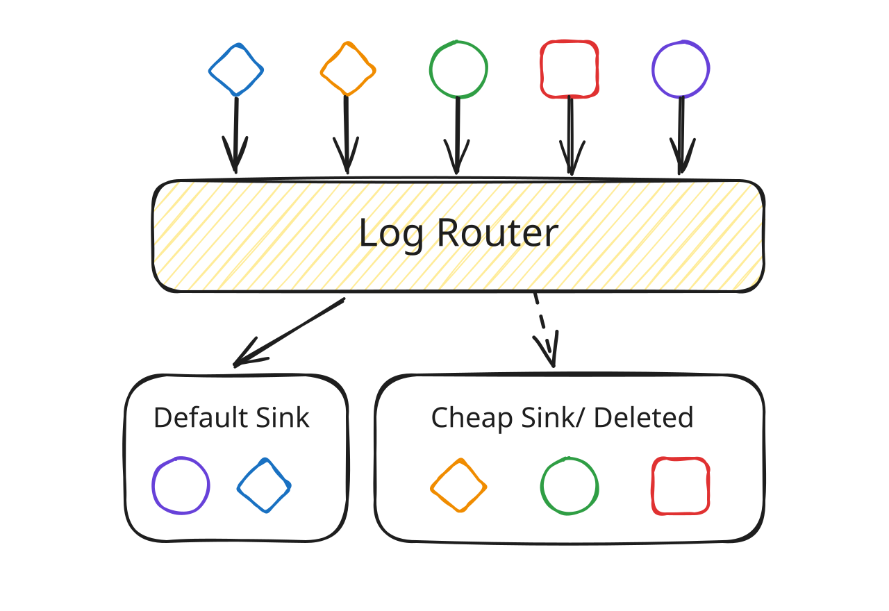

Recently learned that GCP log storage is **EXPENSIVE** 😱

<https://cloud.google.com/products/observability/pricing?hl=en>

Logging storage: $0.50/GiB per month\
Logging retention: $0.01/GiB per month\
Standard Cloud Storage: $0.02/GiB per month

Even for a service without particularly high traffic, application logs from a microservice fleet can easily pile up to a couple of TiBs.
1 TiB of logs per month costs **$512**. That's roughly the monthly price of an `n4-standard-16` instance (16 vCPUs and 64 GiB of RAM).

Microservices generate plenty of logs: request logs, response logs, and health-check logs.
Forgetting to exclude health-check logs can make the cost even worse.

There is **nothing** inherently wrong with logging requests and responses in an application, IMO.
The cost comes from storing those logs in GCP, not simply from the logs being verbose.
If the applications were running locally or in test environments, would we blame the logs?

_Log Router_ comes to the rescue.

## Log Router

<div style="max-width: 42rem; margin-inline: auto;">



</div>

<https://docs.cloud.google.com/logging/docs/routing/overview>

Using Log Router with a `sample()` filter, we can exclude a percentage of logs from the default sink and save money.

For example, most `200 OK` responses may be useless even for debugging. For HTTP request logs, we can configure an exclusion filter for the default sink in Log Router like this:

```text
resource.type = "k8s_container"
httpRequest.status = 200
sample(insertId, 0.9)
```

This excludes about 90% of matching logs. Lower `0.9` if you want to keep more.

## Reflection

This was a good reminder that being an engineer isn't just about writing application code.
We also need to understand the infrastructure our code runs on and how it affects the business.
A good engineer can connect application behavior, infrastructure controls, and business impact.
In this case, knowing Log Router turned a complaint about too many logs into a practical way to cut the bill without simply telling developers to log less.

Blaming application logging is easy; removing useful logs is a shortcut, not a solution.
Good engineers know whether a problem belongs in the application or the infrastructure, then choose the right solution.
