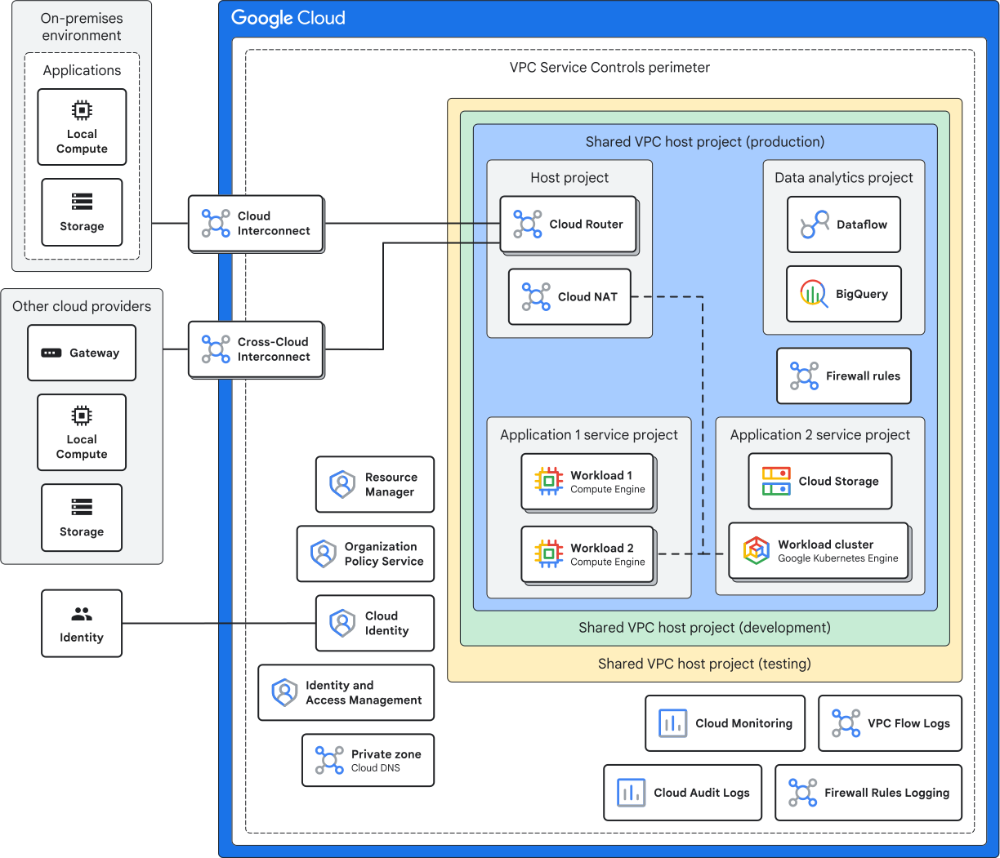

All kinds of network connectivity.

## Read The Docs

<https://docs.cloud.google.com/architecture/landing-zones>\
<https://docs.cloud.google.com/architecture/landing-zones/decide-network-design>\
<https://docs.cloud.google.com/architecture/best-practices-vpc-design>

## 1. GCP resource → Public Internet

| Situation | What to use |
| --- | --- |
| VM has an external IP | Works directly |
| VM has **no** external IP | **Cloud NAT** needs a Cloud Router too, just as a config holder |
| Serverless (Cloud Run / Cloud Functions) default egress | Works out of the box |
| Serverless requiring a static/fixed egress IP | **Direct VPC Egress** (or less preferred Serverless VPC Access connector) routed to a subnet with **Cloud NAT** |

Old App Engine uses Serverless VPC Access.

## 2. GCP resource → Google APIs

| Situation | What to use |
| --- | --- |
| VM has an external IP | Works by default |
| VM has **no** external IP | Enable **Private Google Access** on the subnet |
| Serverless calling Google APIs | Works by default |
| Need strong data-exfiltration protection (security boundary) | **VPC Service Controls** + Private Google Access |
| Need to reach a 3rd-party SaaS or expose your own service privately | **Private Service Connect (PSC)** |

## 3. Serverless → VPC resources

Including on-prem resources.

| Situation | What to use |
| --- | --- |
| App Engine / Cloud Functions / Cloud Run needs to reach a VM, Memorystore, or an on-prem database through an existing VPN tunnel | **Direct VPC Egress** preferred. Or Serverless VPC Access connector |

>[!TIP] Note
> Serverless products do not live inside your VPC by default.
> The connector is the "bridge" that lets them send traffic into your VPC.

## 4. GCP ↔ On-premises

| Situation | What to use |
| --- | --- |
| Low/medium bandwidth, OK to go over a tunnel, lower cost | **Cloud VPN** use Cloud Router with BGP for dynamic routing, or static routes |
| High bandwidth, low latency, production-critical traffic | **Dedicated Interconnect** direct physical link to Google |
| Want interconnect-level quality, but don't want to build your own physical link | **Partner Interconnect** through a service provider |

## 5. VPC ↔ VPC

| Situation | What to use |
| --- | --- |
| A few VPCs, each team wants to keep managing their own VPC independently | **VPC Peering** (note: **not transitive**, and subnets must **not overlap**) |
| Many projects should share one network, with centralized IP/subnet/firewall management | **Shared VPC** one host project + many service projects |
| Many VPCs + many on-prem sites, large mesh-style topology | **Network Connectivity Center** (hub-and-spoke model) |
| One single instance must belong to multiple separate VPCs at the same time | **Multiple NICs** |

>[!NOTE]
> **Shared VPC** is generally the best practice for enterprise environments within a single organization.\
> Use **VPC Peering** or **PSC** when _crossing_ organization boundaries.

## 6. Internet users → service deployed on GCP

| Situation | What to use |
| --- | --- |
| Public web app, need global reach, CDN, WAF, SSL | **External Application Load Balancer (ALB)** + Cloud CDN + Cloud Armor |
| Non-HTTP protocols, gaming, raw TCP/UDP, or preserving client source IP | **External Network Load Balancer (NLB)** (Passthrough) |
| Non-HTTP (TCP/SSL only) needing Global Anycast IP, TLS termination, or Cloud Armor | External Proxy NLB |
| Only internal/VPN users should reach the service, not the public internet | **Internal Load Balancer** ALB or NLB |

## 7. Google-managed services that need a private IP

| Situation | What to use |
| --- | --- |
| Cloud SQL, Memorystore, etc. need a private IP address inside your VPC | **Private Services Access** (based on VPC Peering) or Private Service Connect |

You will notice it creates a new VPC Network Peering.

## Quick memorization tips

- Private VM Outbound to internet: Cloud NAT
- Serverless Outbound to internet (with static IP): Direct VPC Egress + Cloud NAT
- Access Google APIs privately: Private Google Access (Subnet-level) or PSC Endpoint
- Serverless entering VPC: Direct VPC Egress / Serverless VPC Access connector
- Connect On-Prem: Cloud VPN (Internet-based) vs. Dedicated/Partner Interconnect (Direct)
- VPC to VPC: Shared VPC (centralized / single org) vs. Peering (decentralized / non-transitive)
- Managed DBs (Cloud SQL / Redis): Private Services Access (PSA) / Private Service Connect (PSC)
- Inbound Traffic: Application Load Balancer (L7) vs. Network Load Balancer (L4)
- L4 Load Balancing: Passthrough NLB (UDP/TCP, preserves client IP) vs. Proxy NLB (TCP/SSL only, Global Anycast, TLS termination, Cloud Armor).
