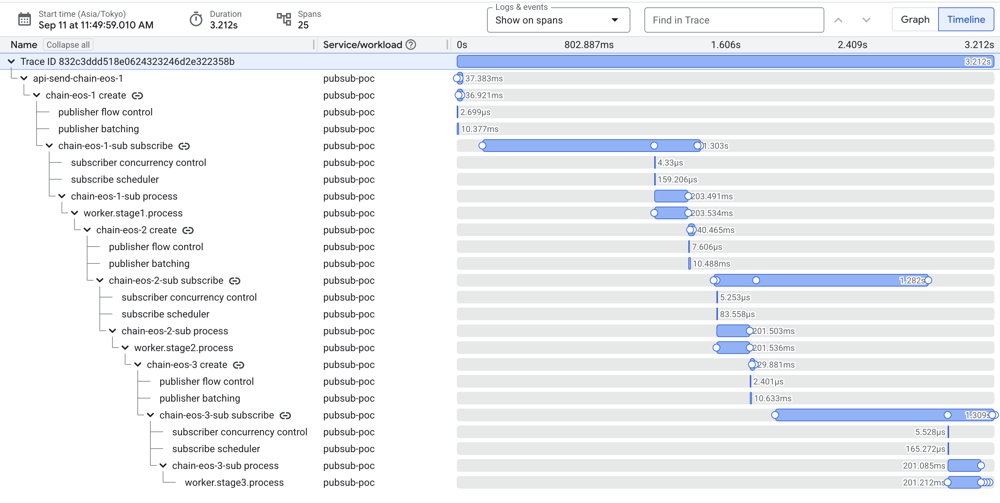
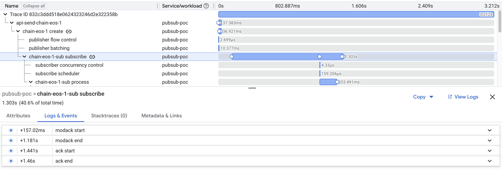
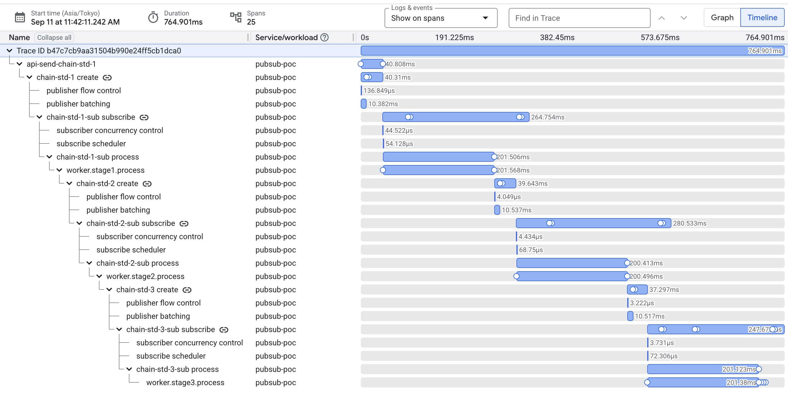
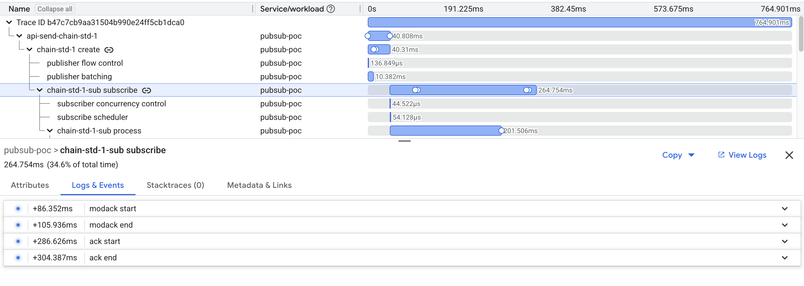

I have been wondering why a nearly-idle service, using Pub/Sub for an async pipeline, has 5+ second end-to-end latency.
Besides the usual ~1s of inter-service call time, Pub/Sub itself adds 3+ seconds.

Suspected our own app code, Pub/Sub's Exactly-Once Delivery and cold start.
To verify, I deployed a Go service locally and on GKE, and used Cloud Trace to investigate.

>[!IMPORTANT] TLDR; Conclusion first.
> Pub/Sub Exactly-Once Delivery(EOS) adds significant, non-trivial latency. Latency-sensitive applications should use  EOS **with caution**.
Didn't test at 100 RPS. Maybe Pub/Sub delivers on its *promise* under high throughput.

Feel free to share in the comments if you know more about this. I might be wrong.

## Latency Factors

- <https://docs.cloud.google.com/pubsub/docs/pull>
- <https://docs.cloud.google.com/pubsub/docs/pull-troubleshooting>

Honestly, Pub/Sub's docs don't explain this latency at all.

GCP admits exactly-once delivery adds latency but no further explanation:
<https://docs.cloud.google.com/pubsub/docs/exactly-once-delivery>

> Exactly-once delivery subscriptions have significantly higher publish-to-subscribe latency compared to regular subscriptions.

**Cold start.** Probably the biggest one.
Pub/Sub is fully managed. Nothing to tune server-side. We can only wish for more traffic, hoping it gets better.

**NumGoroutines.** Configure `ReceiveSettings.NumGoroutines`.
Easy to overlook, but must be set right. Otherwise a service waits on the old message's modack before pulling a new one.
Docs say it doesn't affect concurrent processing. True, but it affects pulling new messages!

**Exactly-Once Delivery.** Warm or cold, EOS is consistently **hundreds of milliseconds higher** per hop than standard.
Not caused by network distance, as it was reproduced on GKE within same region.

That "hundreds of milliseconds" splits into two pieces.

- **Delivery gap**
    Publish ended → subscribe span starts. No span observed. Pure GCP backend routing. Only inferable from timestamps.
- **EOS dispatch gap**
    Subscribe span starts → Ready to handle the message. This is client code.
    Confirmed in [cloud.google.com/go/pubsub/v2@v2.7.0/iterator.go](https://github.com/googleapis/google-cloud-go/blob/78017361caf0da206af1b7ece31471e698b89008/pubsub/v2/iterator.go#L399). The client blocks before handing the message to the callback function.

    ```go
    if !exactlyOnceDelivery {
        // fire-and-forget, batched with a ticker
    } else {
        // If exactly once is enabled, we should wait until modack responses are successes
        // before attempting to process messages.
        ctx := context.Background()
        it.sendModAck(ctx, ackIDs, deadline, false, true)
        for ackID, ar := range ackIDs {
            _, err := ar.Get(ctx) // <-- blocks here
        }
    }
    ```

    `ar.Get(ctx)` = real backend round trip, server confirming the message's lease before the callback runs.
    Standard delivery skips this. That's why only EOS shows this extra delay.

## The Traces

- Two real typical traces below, same environment, one per chain.
- **Both on the warm side** of their own distribution: EOS here 3.212s, std here 764.9ms.

**EOS chain, `chain-eos-1-sub subscribe` 1.303s**

Warm `832c3ddd518e0624323246d2e322358b`



**Standard chain, `chain-std-1-sub subscribe` span: 264ms**

Warm `b47c7cb9aa31504b990e24ff5cb1dca0`



What to look at: in both traces, the simulated `worker.stageN.process` work is identical, 200ms.
The difference is entirely inside the `subscribe` span that wraps it and the blank parts.

## Modack and Ack

GCP docs barely explain this.

- `ModifyAckDeadline` (modack): extend lease. It's like acquiring the lock.
- `Acknowledge` (ack): done processing, permanently remove this message. No more redelivery.

For EOS, it has to wait for the response of modack while standard subscriptions doesn't need to.

**Where each shows up in the trace, and which function writes it:**

- Delivery gap (blank, no span): `publish end` -> `modack start`.
- Dispatch gap: `modack start` -> `modack end`, written by  sendModAck() , same  ModifyAckDeadline  RPC — this is the wait, EOS-only.
- Callback: `modack end` -> `ack start`, callback function(client side)
- Ack: `ack start` -> `ack end`, written by `sendAck()`, wrapping the `Acknowledge` RPC.

Cold, all three inflate together except your callback.
Warm, they shrink and start overlapping in time.

## Test Setup

- 3-hop Go worker chain, **200ms** x3 simulated processing.
- STD and EOS chains deployed side by side on GKE, same code, only subscription type differs.
- `NumGoroutines=4` on EOS and STG workers by default.
- Measured via OpenTelemetry and Cloud Trace, split per hop into delivery gap / EOS dispatch gap / processing.

### Architecture



### Data

- Sample size: n=31 for both, for a fair percentile comparison.
- Protocol: constant 1 RPS per chain for 30s, via a k6 Job running in-cluster.

**Sending method:** `grafana/k6` Job in the same namespace, `constant-arrival-rate` executor, 1 req/s per chain against `api-eos`/`api-std`'s internal Service.

`/send` doesn't wait for the full chain to finish. It returns right after publishing. Latency below is measured end-to-end from Cloud Trace, not `/send`'s response time.

End-to-end latency after **deducting the 600ms** simulation processing time.

| Metric | STD (n=31) | EOS (n=31) |
| --- | --- | --- |
| min | 120ms | 601ms |
| p25 | 132ms | 1955ms |
| p50 | 135ms | 2605ms |
| p75 | 137ms | 2802ms |
| p90 | 226ms | 3606ms |
| **p95** | **233ms** | **4155ms** |
| mean | 146ms | 2618ms |
| max | 236ms | 4707ms |

**Same gaps, summed across all 3 hops per trace** so this is the total delivery/dispatch overhead contributed to one full chain run:

| Gap sum (3 hops) | STD (n=31) | EOS (n=31) |
| --- | --- | --- |
| delivery | ~0ms | min 301ms / p50 368ms / mean 389ms / max 580ms |
| dispatch | ~0ms | min 66ms / p50 1118ms / mean 1455ms / max 3093ms |

Across a full 3-hop chain, EOS's modack wait alone (dispatch gap) contributes roughly 1.1s at the median and up to 3s in the tail — on top of ~370ms of delivery gap. STD contributes essentially nothing on either front.

### Data at 5 RPS

Same setup, same cluster, `rate: 5` instead of `rate: 1` in the k6 Job, and `-num-goroutines=10` (up from the default 4) on **both** STD and EOS workers so the concurrency setting is fair across chains.
This is a warmed-up connection, which is closer to what a real sustained-throughput service looks like:

End-to-end latency **deducting the 600ms** simulated handler time.

| Metric | STD (n=151) | EOS (n=151) |
| --- | --- | --- |
| min | 73ms | 429ms |
| p25 | 174ms | 543ms |
| p50 | 181ms | 639ms |
| p75 | 186ms | 650ms |
| p90 | 188ms | 943ms |
| **p95** | **188ms** | **1643ms** |
| mean | 177ms | 758ms |
| max | 276ms | 2644ms |

**Delivery/dispatch gap sum (3 hops) at 5 RPS:**

| Metric | STD delivery (n=151) | EOS delivery (n=151) | STD dispatch (n=151) | EOS dispatch (n=151) |
| --- | --- | --- | --- | --- |
| min | -12ms | 259ms | 0ms | 29ms |
| p25 | -4ms | 356ms | 0ms | 49ms |
| p50 | -3ms | 386ms | 0ms | 64ms |
| p75 | -2ms | 431ms | 1ms | 94ms |
| p90 | -1ms | 472ms | 1ms | 147ms |
| **p95** | **0ms** | **503ms** | **1ms** | **1062ms** |
| mean | -3ms | 427ms | 1ms | 157ms |
| max | 23ms | 3436ms | 4ms | 3094ms |

I am not sure why the calculation from "Publish End" -> "Subscription Start" in the STD results in negative latencies. You can simply treat these as 0ms.

Next action: will EOS perform better at 100 RPS? 1,000 RPS?
