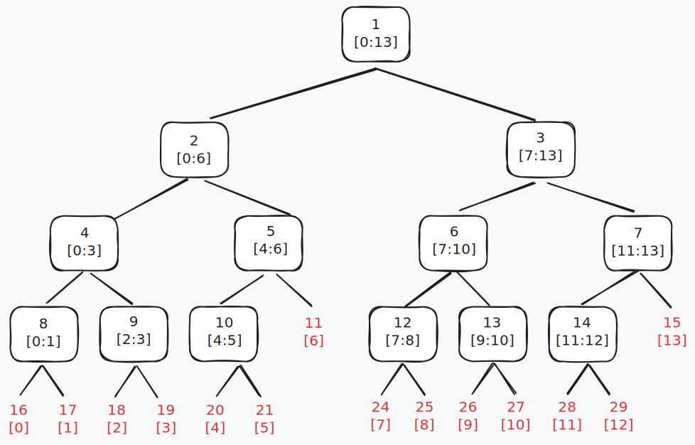
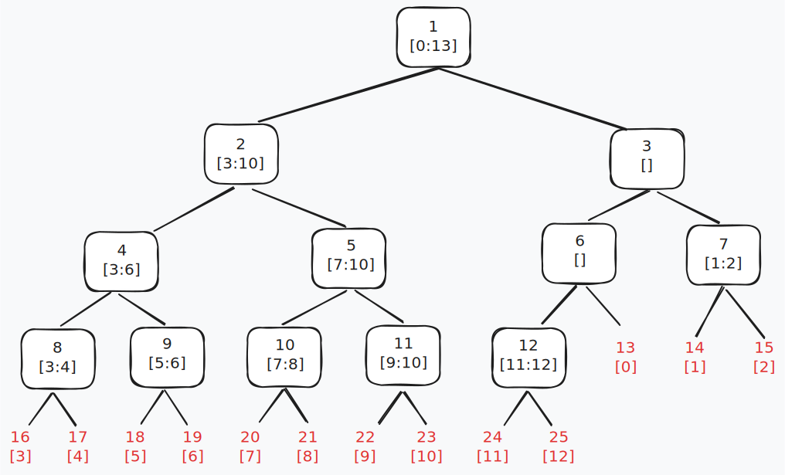

<https://leetcode.com/problems/range-sum-query-mutable/>

1-indexed array. The `i`th element's left child is `2*i` and right child is `2*i+1`.
The parent of a node at i is `int(i/2)`
The first value `tree[1]` stores the range of the whole array.

Time complexity:

- Build: `O(n)`
- Update: `O(log(n))`
- Query: `O(log(n))`

Space: `O(n)`
`n*4` for the usual recursive approach, `n*2` for iterative.

## Recursive

```py
class SegmentTreeRecursive:
    def __init__(self, nums: list[int]):
        self.nums = nums
        self.n = len(nums)
        height = math.ceil(math.log2(len(nums)))
        size = 2 ** (height + 1) - 1
        self.tree = [0] * (size)
        self.build()

    def build(self, x=1, left=0, right=None):
        if right is None:
            right = self.n - 1
        if left == right:
            self.tree[x] = self.nums[left]
            return
        mid = (left + right) // 2
        self.build(x * 2, left, mid)
        self.build(x * 2 + 1, mid + 1, right)
        self.tree[x] = self.tree[x * 2] + self.tree[x * 2 + 1]

    def update(self, target, val, x=1, left=0, right=None):
        if right is None:
            right = self.n - 1
        if left == right:
            self.tree[x] = val  # leaf node
            return
        mid = (left + right) // 2
        if target <= mid:
            self.update(target, val, x * 2, left, mid)
        else:
            self.update(target, val, x * 2 + 1, mid + 1, right)
        self.tree[x] = self.tree[x * 2] + self.tree[x * 2 + 1]

    def sumRange(self, i, j, x=1, left=0, right=None):
        if right is None:
            right = self.n - 1
        if left > j or right < i:
            return 0
        if i <= left and j >= right:
            return self.tree[x]
        mid = (left + right) // 2
        return self.sumRange(i, j, x * 2, left, mid) + self.sumRange(
            i, j, x * 2 + 1, mid + 1, right
        )
```

Taking an array from 0 to 12 as example. The segment tree:



## Iterative

```py
class SegmentTree:
    def __init__(self, nums: List[int]):
        self.n = len(nums)
        self.tree = [0] * (2 * self.n)
        self.nums = nums
        self.build()

    def build(self):
        # init leaf nodes
        for i in range(self.n):
            self.tree[self.n + i] = self.nums[i]

        for i in range(self.n-1, 0, -1):
            self.tree[i] = self.tree[i*2] + self.tree[i*2+1]


    def update(self, idx: int, val: int) -> None:
        idx += self.n
        self.tree[idx] = val # leaf node
        while idx > 1:
            idx = idx // 2
            self.tree[idx] = self.tree[idx*2] + self.tree[idx*2+1]


    def sumRange(self, left: int, right: int) -> int:
        left += self.n
        right += self.n
        s = 0
        while left <= right:
            if left % 2 == 1: # is a right child
                s += self.tree[left]
                left += 1
            if right % 2 == 0: # is a left child
                s += self.tree[right]
                right -= 1
            left = left // 2
            right = right // 2
        return s
```

N = 13. Iterative segment tree:



The graph might look counter-intuitive. But the segment tree works the same.

## Application

Aside from calculating range sum. The `query` function can be calculating minimum/maximum of a range.

<https://leetcode.com/problems/count-number-of-teams/>

For the problem 1395. Count Number of Teams. We convert counting the number of smaller/greater numbers into range sum, by counting frequency.
