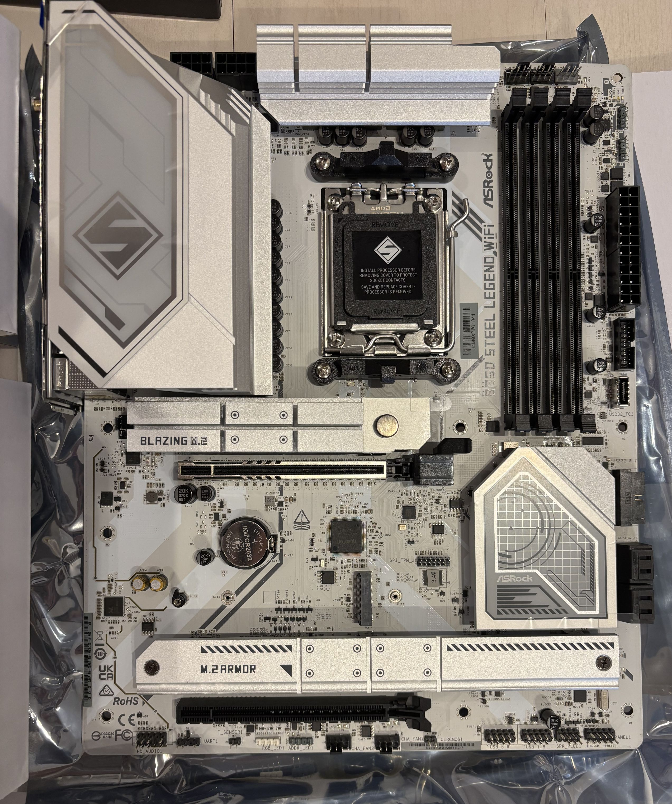
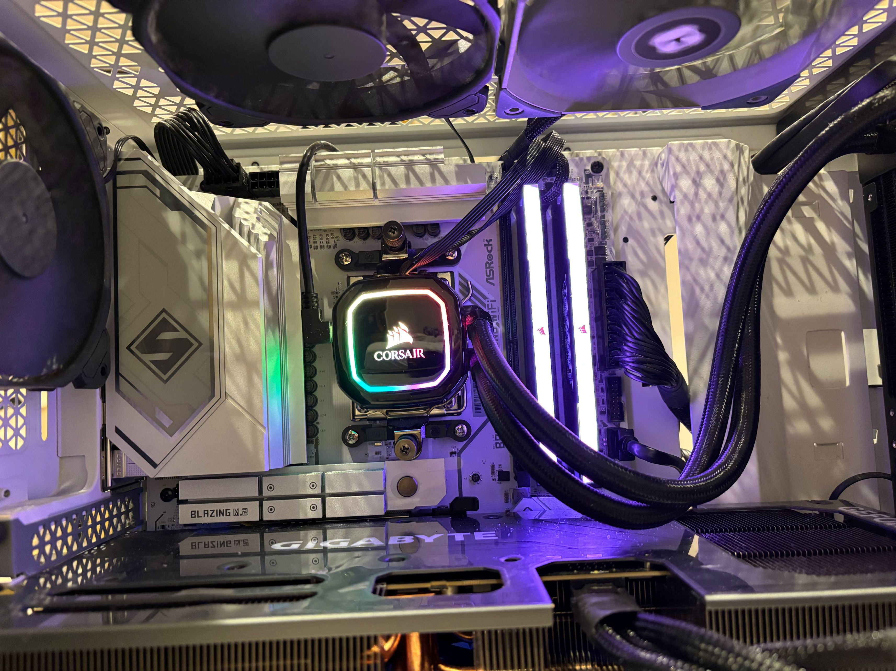

旧的是 4 年半前配的 AMD 5800X + MSI B550 Gaming Plus + Corsair DDR4 16GB\*2.\
主板没有 WiFi 或蓝牙，于是自己买了 PCIe 无线网卡。网卡用起来没什么问题，直到有一天 Windows 绿屏死机了。
WiFi 没什么问题，但是只要一尝试蓝牙连接设备就立刻绿屏。试过更新系统等，但是没有解决，刚好我嫌弃这台电脑编译 Go 非常慢，于是干脆升级 CPU 主板内存了。

新的是 AMD 9800X3D + ASRock B850 Steel Legend WiFi + Corsair DDR5 16GB\*2.\
听说过最近内存涨价，没想到涨价这么多。一年前同样的 16GB\*2 内存是 ￥20,000 日元左右，现在要花 ￥40,000 日元！这些搞 AI 的真坏真坏呀。

安装过程中，显卡果不其然又无法点亮。显卡是 Gigabyte RTX 4080 Super Gaming OC 16G.
根据之前的 2 次安装经验，似乎用别的显卡先点亮再把 Gigabyte 的放进来会有效。这次没能幸运成功解决。
但是我发现了一个说明书上和官网没有写的东西，一个可以切换 Turbo/Silent 模式的按钮！
它一直是 Turbo 模式，我切到了 Silent 后似乎能成功点亮了。
这个按钮太隐蔽了，我用了一年多了愣是没发现。可以在上面的图里下方的显卡正中间看到这个按钮。

风扇积累了 4 年多的灰尘，特别脏。所以这次也刚好清理了一下，干净如初。

Windows 也直接重装了，非常清爽。

新设备新系统跑个分：\
Cyberpunk 2077, 4K 光线追踪超级：平均 FPS 76.92\
3D Mark Steel Nomad 6376\
3D Mark Time Spy Extreme 11892

CPU 温度一直有点高，冬天 5% 负载时 40 度。

>[!IMPORTANT] 致谢
> 感谢 Kani 的大力支持。（此条五毛，括号要删掉）
